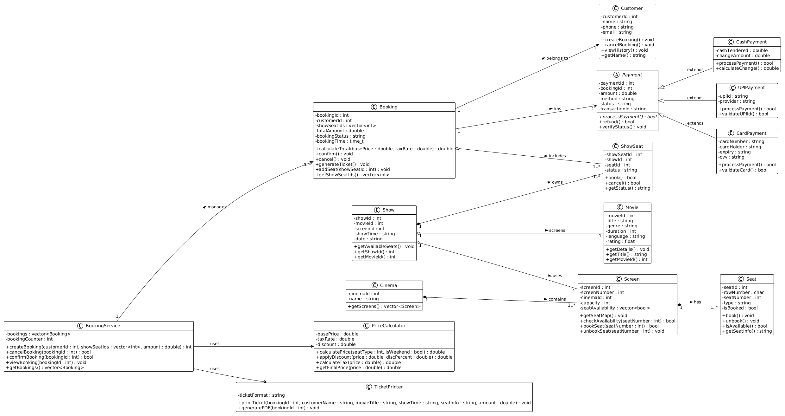
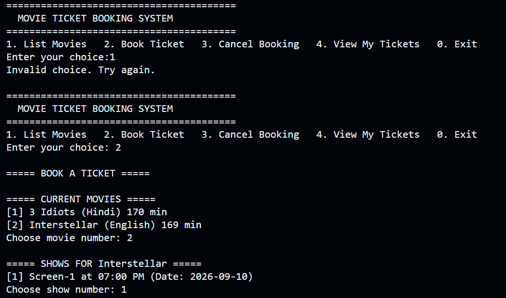
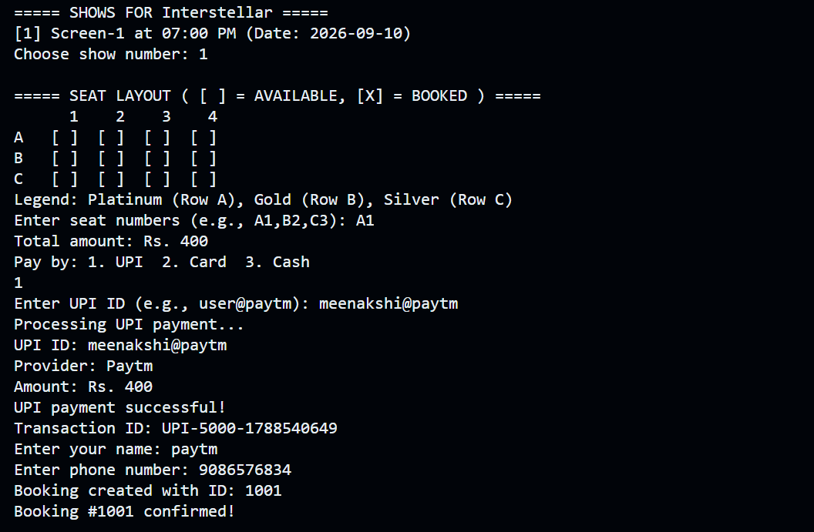

# Movie Ticket Booking System

### Features
- List movies, shows, seat layout
- Book seats with UPI/Card/Cash
- Print ticket and cancel booking
---
### Technologies Used

Programming Language: C++

Concepts: Object-Oriented Programming (OOP)

Compiler: GCC / G++

Version Control: Git & GitHub

---

## Project Structure 
```
movie-ticket-booking-system/
│
├── diagrams/
│   ├── class-diagram.png
│   └── sequence-diagram.png
│
├── docs/
│   └── Assignment-1.pdf
│
├── screenshots/
│   ├── 1.png
│   ├── 2.png
│   └── 3.png
│
├── src/
│   ├── Booking.cpp
│   ├── BookingService.cpp
│   ├── CardPayment.cpp
│   ├── CashPayment.cpp
│   ├── Customer.cpp
│   ├── Movie.cpp
│   ├── Payment.cpp
│   ├── PriceCalculator.cpp
│   ├── Screen.cpp
│   ├── Seat.cpp
│   ├── Show.cpp
│   ├── ShowSeat.cpp
│   ├── TicketPrinter.cpp
│   ├── UPIPayment.cpp
│   └── main.cpp
│
├── .gitignore
└── README.md
```
---

## UML Diagrams

### Class Diagram


### Sequence Diagram 

---
##  Demo Run 

### 1. Main Menu & Listing Movies


### 2. Booking Flow – Selecting Show and Seats


### 3. Payment, Ticket, and Confirmation


---
## System Workflow
```
Start
  │
  ▼
View Movies
  │
  ▼
Select Show
  │
  ▼
View Available Seats
  │
  ▼
Select Seats
  │
  ▼
Calculate Price
  │
  ▼
Choose Payment Method
  │
  ▼
Confirm Booking
  │
  ▼
Generate Ticket
  │
  ▼
End
```
---

### How to Run
```bash
g++ src/main.cpp -o ticket-system
./ticket-system
```

---
## Academic Information

Course: TCS-504 System Design

Assignment: Assignment 1

Project: Movie Ticket Booking System

Language: C++

---
## Author

Meenakshi Pandey

---

## Licence 

This project was developed for academic and educational purposes.

---
